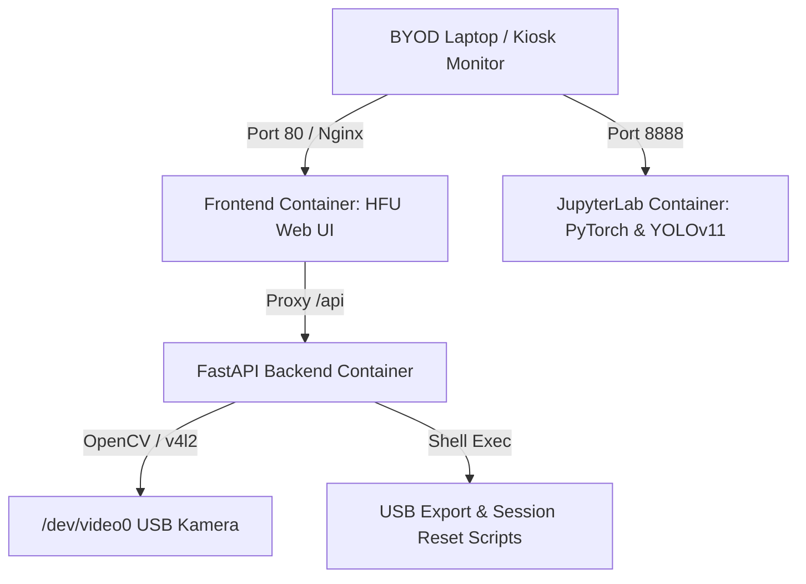

# 🎓 HFU KI-Praktikumsstation: Autarke Objekterkennung mit YOLOv11 & NVIDIA Jetson Orin Nano


[](https://developer.nvidia.com/embedded/jetson-orin-nano-developer-kit)
[](https://github.com/ultralytics/ultralytics)
[](https://www.docker.com/)
[](LICENSE)
[](#)

Entwickelt für die **Hochschule Furtwangen (HFU)** – Fakultäten *Medical and Life Sciences*, *Maschinenbau* und *Wirtschaftsingenieurwesen (WIng)*.

Diese autarke Praktikumsanwendung bietet Studierenden **ohne Vorkenntnisse im Bereich Deep Learning** einen intuitiven, praxisnahen Einstieg in die industrielle Objekterkennung. Das System läuft vollständig dockerisiert auf dem **NVIDIA Jetson Orin Nano** und ist für den **100%igen Offline-Betrieb** im Labor konzipiert.

---

## 📸 Screenshots & Benutzeroberfläche

Die Weboberfläche im **"Clean Academic"** Stil basiert auf den offiziellen Corporate-Design-Farben der Hochschule Furtwangen (HFU-Grün `#008738`):

- **Dashboard & BYOD Portal:** Zentrale Anlaufstelle für Studierende zum Starten von JupyterLab, Einsehen von Hardware-Metriken und Verfolgen der 6 Praktikumsschritte.
- **Kiosk- & Fokus-Test:** Live-Kamerabild mit Messung der Bildschärfe am Siemensstern (Laplace-Varianz) und Ausleuchtungs-Kontrolle.
- **Messe- / Demo-Modus:** Gamifizierter Präsentationsmodus mit Echtzeit-Inferenz, FPS-Anzeige und automatischem *Attract-Screen* (Slideshow bei Inaktivität).
- **Header Status-Bar:** Permanente Anzeige des Zustands von Kamera, WLAN-Hotspot und Docker-Containern sowie **DE/EN-** und **Theme-Toggle (Light/Dark Mode)**.

---

## 🛠️ Hardware- & Systemarchitektur

### Hardware-Komponenten
| Komponente | Spezifikation |
|---|---|
| **Recheneinheit** | NVIDIA Jetson Orin Nano Developer Kit (NVMe SSD) |
| **Kamera** | USB 3.0 Industriekamera (C-Mount, manueller Fokusring) |
| **Prüffläche** | 80 x 60 cm Arbeitsfläche mit Bosch-Lichtbalken & Siemensstern |
| **Display** | 19-Zoll Monitor für den Stand-/Kiosk-Betrieb |
| **Netzwerk** | 5GHz Wi-Fi Access Point (`AI-LAB-ORIN-XX`) für BYOD (Laptop der Studierenden) |

### Docker-Container-Architektur



---

## 🚀 Schnellstart & Installation auf dem Jetson

### 1. Repository klonen & Auto-Setup ausführen
Führe auf einem neu aufgesetzten NVIDIA Jetson Orin Nano einfach folgenden Befehl aus:

```bash
git clone https://github.com/DEIN_USERNAME/hfu-ai-lab.git
cd hfu-ai-lab
sudo ./setup.sh
```

**Was `setup.sh` automatisch erledigt:**
1. Installiert Docker, Docker-Compose, Kamera-Treiber und Netzwerk-Tools.
2. Richtet den Linux-Systemdienst `hfu-ai-lab.service` ein (**Autostart beim Booten**).
3. Baut und startet alle Docker-Container.

### 2. Stand-SSID anpassen (Multi-Stand-Betrieb)
Falls mehrere Stände in einem Raum betrieben werden, passe die Hotspot-SSID an (z. B. Stand `02` -> `AI-LAB-ORIN-02`):
```bash
sudo ./scripts/set_ssid.sh 02
```

---

## 🔄 Smart Auto-Update & Offline-Betrieb

Das System vereint maximale Zuverlässigkeit im Labor mit einfacher Wartung:
- **🌐 Online (mit Internet):** Beim Start prüft das Skript [`scripts/update.sh`](scripts/update.sh) innerhalb von 2 Sekunden, ob auf GitHub ein neues Release vorliegt. Falls ja, wird automatisch `git pull` ausgeführt und die Container aktualisiert.
- **🔌 Offline (im Laborbetrieb):** Bricht die Online-Prüfung sofort nach 2 Sekunden ab und startet die lokal gecachten Docker-Container **ohne Verzögerung im 100% Offline-Modus**.

---

## 📚 Die 6 Praktikums-Module (Bilinguale Jupyter Notebooks)

Alle Notebooks befinden sich im Ordner `notebooks/` und enthalten Erklärungen in **Deutsch und Englisch**:

| Nr. | Notebook | Inhalt & Didaktische Ziele |
|---|---|---|
| **01** | [`01_hardware_test_and_focus.ipynb`](notebooks/01_hardware_test_and_focus.ipynb) | **Hardware & Fokus:** Siemensstern-Schärfetest (Laplace-Varianz), Beleuchtungseinstellung mit Bosch-Lichtbalken. |
| **02** | [`02_pretrained_coco_exploration.ipynb`](notebooks/02_pretrained_coco_exploration.ipynb) | **COCO Exploration:** Testen von vortrainiertem YOLOv11n auf 80 Alltagsklassen. Verständnis von Confidence Thresholds. |
| **03** | [`03_image_acquisition.ipynb`](notebooks/03_image_acquisition.ipynb) | **Bilderfassung:** Aufnahme von 30+ Bildern (Szenario 1: OP-Besteck / Szenario 2: IXO Akkuschrauber). |
| **04** | [`04_assisted_labeling.ipynb`](notebooks/04_assisted_labeling.ipynb) | **Assisted Labeling:** KI-unterstützte Auto-Annotation & Erstellung der `data.yaml`. |
| **05** | [`05_yolov11_training.ipynb`](notebooks/05_yolov11_training.ipynb) | **Training:** Transfer Learning mit YOLOv11 direkt auf der Orin Nano GPU. Auswertung von Loss-Kurven. |
| **06** | [`06_realworld_evaluation_and_export.ipynb`](notebooks/06_realworld_evaluation_and_export.ipynb) | **Evaluation & Export:** **TensorRT Export (`.engine`)**, Latenz-Vergleich, **PDF-Protokollgenerierung** & USB-Export. |

---

## 💾 USB-Export & Praktikum Zurücksetzen

- **Daten-Export:** Am Ende des Praktikums klicken Studierende im Web-Dashboard auf **"💾 Daten auf USB-Stick exportieren"** (oder führen `bash scripts/export_to_usb.sh` aus). Alle Bilder, Labels, TensorRT-Modelle und das PDF-Protokoll werden auf einen angeschlossenen USB-Stick kopiert.
- **Session-Reset:** Vor der nächsten Gruppe löscht ein Klick auf **"🗑️ Praktikum Zurücksetzen"** (oder `bash scripts/reset_session.sh`) alle temporären Daten.

---

## 📄 Lizenz & Danksagung

Projekt entwickelt für die **Hochschule Furtwangen (HFU)**.  
Lizenziert unter der [MIT Lizenz](LICENSE). Powered by [Ultralytics YOLOv11](https://github.com/ultralytics/ultralytics) & [NVIDIA Jetson](https://developer.nvidia.com/embedded-computing).
